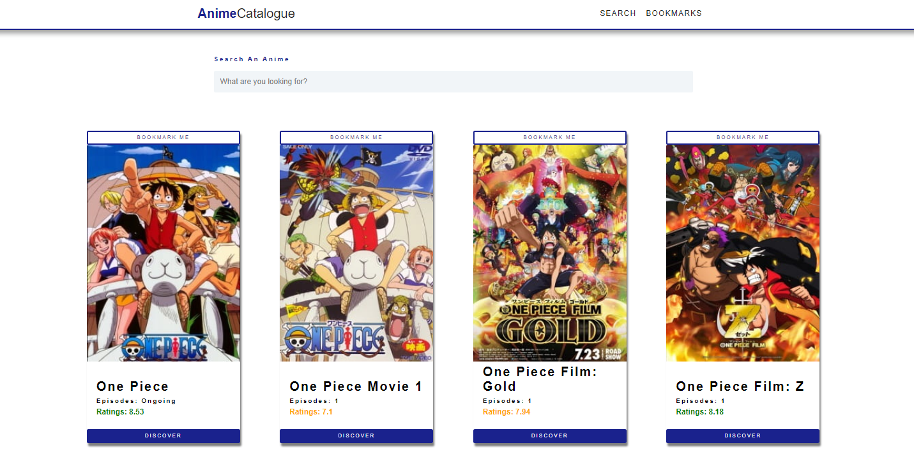

# AnimeCatalogue

> Pocket anime catalogue

---

### Table of Contents

Sections headers used to reference location of destination.

- [Demo](#demo)
- [Description](#description)
- [How To Use](#how-to-use-in-your-local-environment)
- [API reference](#api-used-reference)
- [Author Info](#author-info)

---

## Demo

> View demo at: https://anime-catalogue.netlify.app/

---

## Description

This is a pocket catalogue for Anime where a user can search an anime, view its details, and bookmark them. This application uses the Jikan API which is the unofficial MyAnimeList API. The API itself is completely public and does not require OAuth from the user. The get request/anime lookup from the API does not have a daily limit, so the user does not have to worry about going over any daily quotas for fetching data.

This project demonstrates the effectiveness of a single-paged application, showing the fast nature of React.js. React-router-dom library is used for routing and hooks and Context API for state management.

#### Technologies

- Visual Code Studio
- React.js
- JavaScript
- Markdown
- HTML & CSS (SASS)
- UI/UX
- Responsive
- YouTube API

[Back To The Top](#animecatalogue)

---

## How to use in your local environment

#### Prerequisites

- You must have node.js installed to have npm
- Clone this repository

#### Installation

`npm install && npm start `

---

## API used reference

Jikan API: https://jikan.moe/

[Back To The Top](#animecatalogue)

---

## Author Info

- linkedIn - [@jpev.dev](https://linkedin.com/in/jianneevangelista)
- Website - [jp.ev](https://jpce.netlify.app/)

[Back To The Top](#animecatalogue)
